# 🕹️ Repozytorium Dokumentacji Mechanicznej - Konsola Arcade

Witam w oficjalnym repozytorium projektu automatu do gier. Repozytorium zawiera posegregowane pliki źródłowe modeli CAD (`.IPT`), główny plik złożenia (`.IAM`) oraz plik projektu środowiska Autodesk Inventor (`.IPJ`).

---

> 💡 **Instrukcja nawigacji:** Po otwarciu poniższego linku, możesz swobodnie obracać model 3D całej maszyny. Użyj drzewa operacji po lewej stronie ekranu – **nakierowanie kursora myszy na dowolny element z listy podświetli go bezpośrednio na modelu.**

### 🔗 [KLIKNIJ TUTAJ, ABY OTWORZYĆ INTERAKTYWNY MODEL 3D W PRZEGLĄDARCE](https://viewer.autodesk.com/id/dXJuOmFkc2sub2JqZWN0czpvcy5vYmplY3Q6YTM2MHZpZXdlci1wcm90ZWN0ZWQvdDE3ODE3MTU0MzZfNmUxZGRkZTQtMzYxZi00NTI3LWJkZjktMTA5YzNlNmUwY2QxLmlwdA?sheetId=ZTk1MjU1NzMtMDU2MC00YTAyLTk5YjItODJmOTcyMzI3NDM4)

---

## 📂 Pliki Główne
W głównym katalogu repozytorium znajdują się pliki spajające cały projekt:
* 🛠️ **`konsola.iam`** - Główne złożenie maszyny.
* ⚙️ **`konsola.ipj`** - Plik projektu środowiska Inventor.

---

## 📌 Zestawienie Plików Źródłowych Inventor (`.IPT`)

Poniżej znajduje się wizualne zestawienie wszystkich zaprojektowanych elementów, zgodnie ze strukturą folderów w repozytorium.

### ⬅️ Przód Maszyny (Folder: `/Przod`)
| Podgląd | Pliki (URL) | Krótki Opis Elementu |
| :---: | :--- | :--- |
| 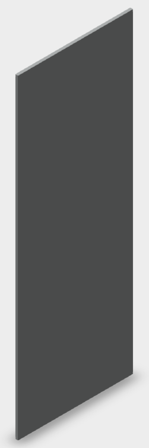 | [CUT PART K.ipt](./Przod/CUT%20PART%20K.ipt)   [CUT PART K-01.ipt](./Przod/CUT%20PART%20K-01.ipt) | **Panel sterowania:** Płyta, w której montowane są joysticki. |
|  | [CUT PART I.ipt](./Przod/CUT%20PART%20I.ipt)   [CUT PART I-01.ipt](./Przod/CUT%20PART%20I-01.ipt) | **Drzwi frontowe:** Duży przedni panel rewizyjny obudowy. |
| 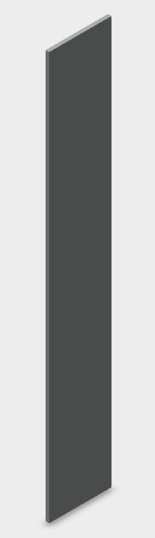 | [CUT PART D.ipt](./Przod/CUT%20PART%20D.ipt)   [CUT PART D-01.ipt](./Przod/CUT%20PART%20D-01.ipt) | **Przód panelu:** Pionowa maskownica pod panelem głównym. |

---

### 📦 Korpus i Rama (Folder: `/korpus`)
| Podgląd | Pliki (URL) | Krótki Opis Elementu |
| :---: | :--- | :--- |
| 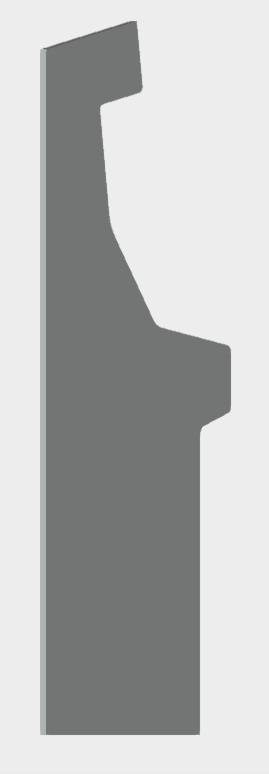 | [CUT PART A.ipt](./korpus/CUT%20PART%20A.ipt)   [CUT PART A-01.ipt](./korpus/CUT%20PART%20A-01.ipt) | **Panel boczny:** Profil stanowiący konstrukcję nośną szafy. |
|  | [CUT PART B.ipt](./korpus/CUT%20PART%20B.ipt)   [CUT PART B-01.ipt](./korpus/CUT%20PART%20B-01.ipt) | **Panel górny:** Sufit zamykający konstrukcję od góry. |
| 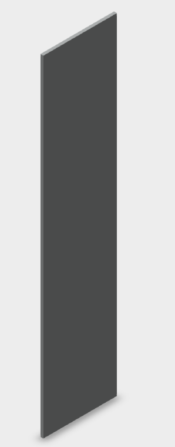 | [CUT PART C.ipt](./korpus/CUT%20PART%20C.ipt)   [CUT PART C-01.ipt](./korpus/CUT%20PART%20C-01.ipt) | **Spód szyldu:** Płyta zamykająca podświetlany baner od dołu. |
| 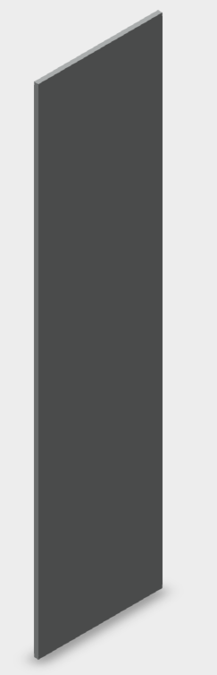 | [CUT PART H.ipt](./korpus/CUT%20PART%20H.ipt)   [CUT PART H-01.ipt](./korpus/CUT%20PART%20H-01.ipt) | **Panel głośników:** Płyta podtrzymująca system audio. |
|  | [CUT PART J.ipt](./korpus/CUT%20PART%20J.ipt)   [CUT PART J-01.ipt](./korpus/CUT%20PART%20J-01.ipt) | **Podłoga:** Dolny panel stanowiący podstawę automatu. |

---

### ➡️ Tył Maszyny (Folder: `/Tyl`)
| Podgląd | Pliki (URL) | Krótki Opis Elementu |
| :---: | :--- | :--- |
|  | [CUT PART G.ipt](./Tyl/CUT%20PART%20G.ipt)   [CUT PART G-01.ipt](./Tyl/CUT%20PART%20G-01.ipt) | **Dolny panel tylny:** Płyta zamykająca plecy automatu. |

---

### 🛠️ Elementy Dodatkowe (Folder: `/elementy_dodatkowe`)
| Podgląd | Pliki (URL) | Krótki Opis Elementu |
| :---: | :--- | :--- |
| 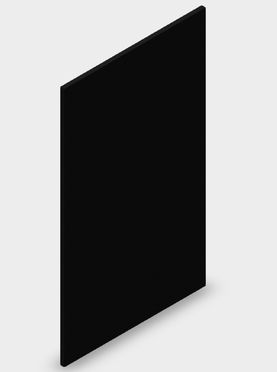 | [monitor.ipt](./elementy_dodatkowe/monitor.ipt) | Model 3D użytego monitora LCD (element referencyjny). |
| 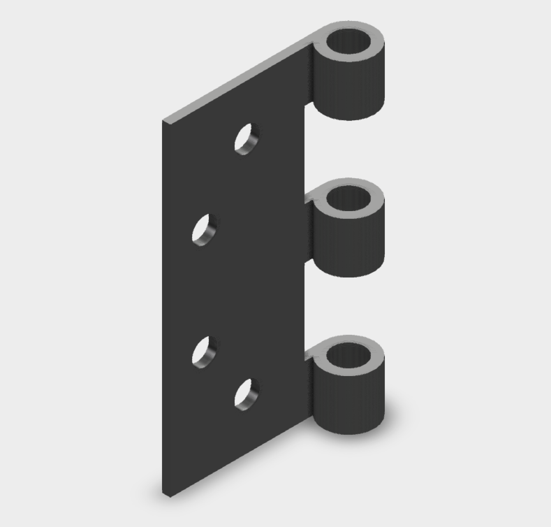 | [zawias-lewy.ipt](./elementy_dodatkowe/zawias-lewy.ipt) | Lewy zawias drzwiczek frontowych. |
| 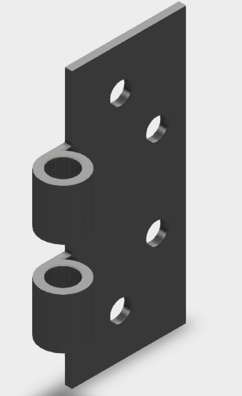 | [zawias-prawy.ipt](./elementy_dodatkowe/zawias-prawy.ipt) | Prawy zawias drzwiczek frontowych. |
| 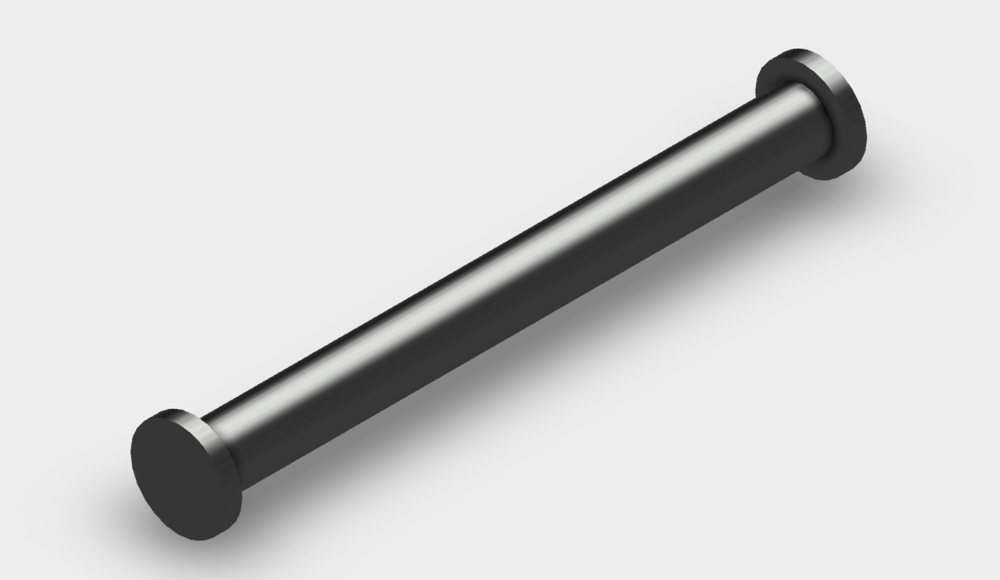 | [trzpien.ipt](./elementy_dodatkowe/trzpien.ipt) | Element mechanizmu zawiasu/zamka. |
| 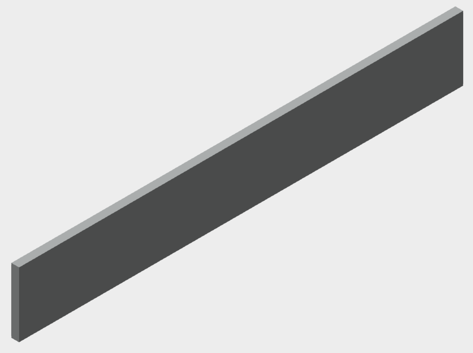 | [CUT PART N.ipt](./elementy_dodatkowe/CUT%20PART%20N.ipt)   [CUT PART N-01.ipt](./elementy_dodatkowe/CUT%20PART%20N-01.ipt) | Wewnętrzny wspornik / element konstrukcyjny. |
| 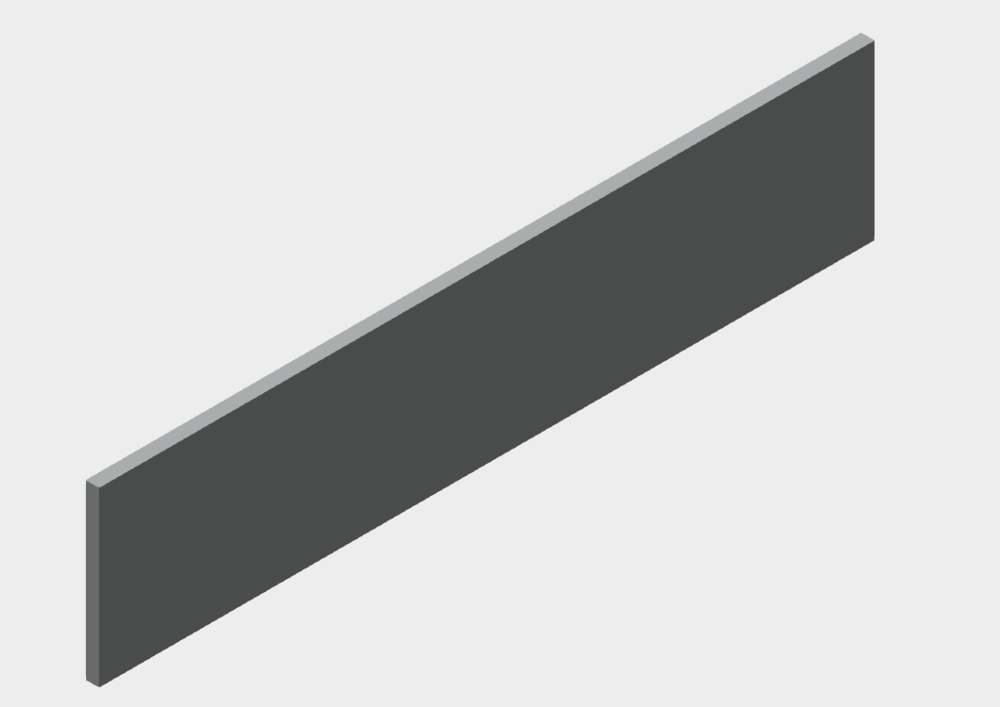 | [CUT PART O.ipt](./elementy_dodatkowe/CUT%20PART%20O.ipt)   [CUT PART O-01.ipt](./elementy_dodatkowe/CUT%20PART%20O-01.ipt) | Wewnętrzny wspornik / element konstrukcyjny. |
| 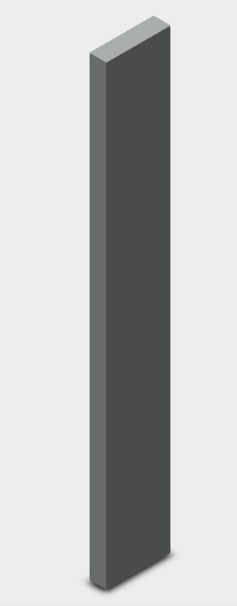 | [CUT PART P.ipt](./elementy_dodatkowe/CUT%20PART%20P.ipt)   [CUT PART P-01.ipt](./elementy_dodatkowe/CUT%20PART%20P-01.ipt) | Wewnętrzny wspornik / element konstrukcyjny. |
| 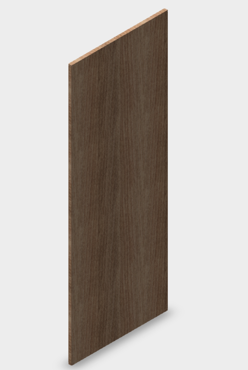 | [CUT PART R.ipt](./elementy_dodatkowe/CUT%20PART%20R.ipt)   [CUT PART R-01.ipt](./elementy_dodatkowe/CUT%20PART%20R-01.ipt) | Wewnętrzny wspornik / element konstrukcyjny. |
